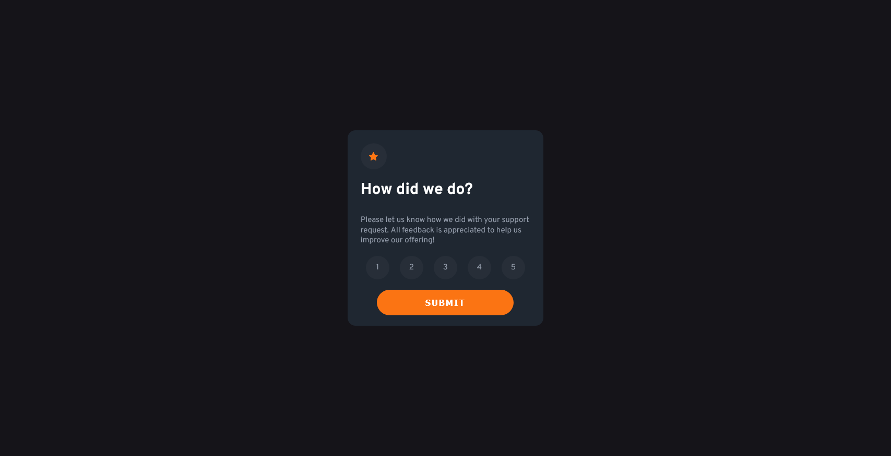

# Frontend Mentor - Interactive rating component solution

This is a solution to the [Interactive rating component challenge on Frontend Mentor](https://www.frontendmentor.io/challenges/interactive-rating-component-koxpeBUmI). Frontend Mentor challenges help you improve your coding skills by building realistic projects.

## Table of contents

- [Overview](#overview)
  - [The challenge](#the-challenge)
  - [Screenshot](#screenshot)
  - [Links](#links)
- [My process](#my-process)
  - [Built with](#built-with)
  - [What I learned](#what-i-learned)
  - [Useful resources](#useful-resources)
- [Author](#author)

**Note: Delete this note and update the table of contents based on what sections you keep.**

## Overview

This is a frontend mentor | Interactive rating component challenge, in this challenge the program will make a wrapper( using <div>) for the ratings page and the thank you page

When the page load, it will display the rating page and the rating-wrapper will show, the thank you page will display as none, after the user have select the rating it will pass in an .active class into score selection button, when the rating is subbmited it will read the data-rate attribute and pass it in to the thank you page(if the user didn't selected any rating it will pop out an alert)

in the thank you page it will show up the passed in value and change the innerHTML (for ex. You selected 5 of out of 5) and the other layout will remain the same.

Lastly, the page is responsive for both desktop and moblie width

### The challenge

Users should be able to:

- View the optimal layout for the app depending on their device's screen size
- See hover states for all interactive elements on the page
- Select and submit a number rating
- See the "Thank you" card state after submitting a rating

### Screenshot




### Links

- Solution URL: [Add solution URL here](https://github.com/ZetTeoh/frontend-rating.git)
- Live Site URL: [Add live site URL here](https://zetteoh.github.io/frontend-rating/)

## My process

### Built with

- Semantic HTML5 markup
- CSS custom properties
- Flexbox
- javascript

### What I learned

I able to practice how to use javascript in the project, adding classes and remove classes to make object appear differently and use dataset in html.

--HTML--
Using date set in html to record user input:

```html
<div class="score-container">
  <div class="score-number" data-rate="1">1</div>
  <div class="score-number" data-rate="2">2</div>
  <div class="score-number" data-rate="3">3</div>
  <div class="score-number" data-rate="4">4</div>
  <div class="score-number" data-rate="5">5</div>
</div>
```

--CSS--
Using an active classes to and apply it only when user click on the rating score

```css
/* apply classes to the rating score selected */
.active {
  background-color: hsl(25, 97%, 53%);
  color: #fff;
}
```

--javascript--
remove class active from all the rating score and adding it back to the one user selected

```js
  if (e.target.classList.contains("score-number")) {
    // remove active classes from other button
    scoreNumber.forEach((btn) => {
      btn.classList.remove("active");
    });

    e.target.classList.add("active");
```

### Useful resources

- [skillshare HTML,CSS,javascript - Build 6 project](https://skl.sh/3Fr2TT) - This helped me for understanding for to use javascript, html and css well in a project the instructor teaching is straightforward and explain his action really well

## Author

- Frontend Mentor - [@ZetTeoh](https://www.frontendmentor.io/profile/ZetTeoh)
- Twitter - [@hao2796](https://www.twitter.com/hao2796)
